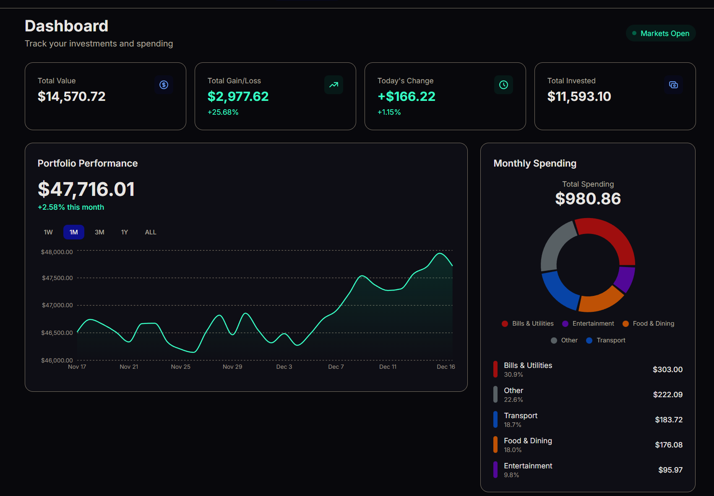
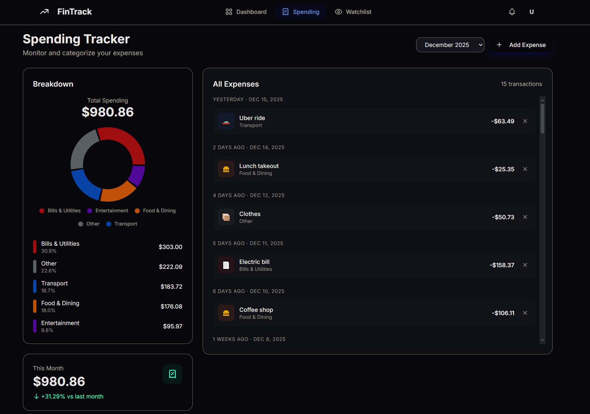
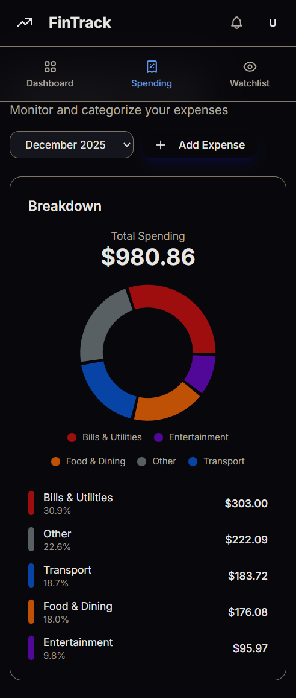

# 📈 FinTrack - Personal Finance Dashboard

<div align="center">
  
  
  
  
  
</div>

<br />

A modern, responsive personal finance dashboard built with React that helps you track investments and manage spending in one beautiful interface. Built after manually tracking my investments in spreadsheets got tedious!

## 📸 Screenshots

### Dashboard

*Portfolio overview with interactive performance chart and holdings list*

### Spending Tracker

*Expense tracking with category breakdown pie chart*

### Mobile View

*Fully responsive design for mobile devices*

## ✨ Features

### 📊 Portfolio Dashboard
- **Real-time portfolio tracking** with total value and daily change
- **Interactive line charts** showing portfolio performance (1W, 1M, 3M, 1Y views)
- **Holdings management** with current price, daily change, and total value
- **Visual indicators** - green for gains, red for losses

### 💰 Spending Tracker
- **Expense entry** with amount, category, date, and description
- **Pie chart breakdown** by category (Food, Transport, Entertainment, Bills, Other)
- **Monthly comparison** showing spending trends
- **Category insights** with percentage breakdown

### 👀 Watchlist
- **Track stocks** without owning them
- **Quick view** of price and daily change
- **Easy add to portfolio** from watchlist
- **Top movers** highlighting best/worst performers

### 🎨 Design
- **Dark mode by default** - easy on the eyes
- **Clean, minimal UI** inspired by modern finance apps
- **Smooth animations** on data updates and page transitions
- **Fully responsive** - works beautifully on mobile

## 🛠️ Tech Stack

| Technology | Purpose |
|------------|---------|
| **React 18** | UI library with hooks |
| **TypeScript** | Type safety and better DX |
| **Redux Toolkit** | Global state management |
| **React Router** | Client-side routing |
| **Tailwind CSS** | Utility-first styling |
| **Recharts** | Data visualization |
| **Vite** | Fast build tool |

## 🚀 Getting Started

### Prerequisites

- Node.js 18+ and npm

### Installation

1. **Clone the repository**
   ```bash
   git clone https://github.com/PohTeyToe/fintrack.git
   cd fintrack
   ```

2. **Install dependencies**
   ```bash
   npm install
   ```

3. **Start the development server**
   ```bash
   npm run dev
   ```

4. **Open your browser**
   Navigate to `http://localhost:3000`

### Environment Variables (Optional)

To use real stock data from Alpha Vantage API, create a `.env` file:

```bash
VITE_ALPHA_VANTAGE_KEY=your_api_key_here
```

Get a free API key at [Alpha Vantage](https://www.alphavantage.co/support/#api-key)

> Note: The app works perfectly with mock data if no API key is provided.

## 📁 Project Structure

```
src/
├── components/
│   ├── charts/           # Chart components (Portfolio, Spending, Mini)
│   ├── common/           # Reusable UI components
│   ├── portfolio/        # Portfolio-specific components
│   ├── spending/         # Spending tracker components
│   └── watchlist/        # Watchlist components
├── hooks/                # Custom React hooks
├── pages/                # Page components
├── store/                # Redux slices and store
├── types/                # TypeScript interfaces
├── utils/                # Utility functions
├── App.tsx               # Root component
└── main.tsx              # Entry point
```

## 🎯 Key Features Explained

### State Management
- **Redux Toolkit** for predictable state updates
- **localStorage persistence** - your data survives refresh
- **Optimistic updates** for snappy UX

### Custom Hooks
- `usePortfolioSummary` - Calculates portfolio statistics
- `usePortfolioHistory` - Filters chart data by time range
- `useStockData` - Fetches and caches stock quotes
- `useLocalStorage` - Syncs state with localStorage

### Data Visualization
- **Area charts** for portfolio performance
- **Pie charts** for spending breakdown
- **Mini sparklines** for quick stock trends

## 📱 Responsive Design

The app is fully responsive with:
- Mobile-first approach
- Collapsible navigation on small screens
- Touch-friendly interactions
- Optimized chart sizes for different viewports

## 🎨 UI/UX Highlights

- **Dark theme** optimized for finance apps
- **Smooth transitions** using CSS animations
- **Loading skeletons** for better perceived performance
- **Color-coded values** (green/red for gains/losses)
- **Inter font** for excellent readability

## 🔮 Future Improvements

- [ ] Add authentication
- [ ] Connect to real-time stock APIs
- [ ] Export data to CSV/PDF
- [ ] Set spending budgets and alerts
- [ ] Add more chart types
- [ ] Implement dark/light theme toggle
- [ ] Add unit tests

## 📝 What I Learned

Building FinTrack taught me:
- **Redux Toolkit** patterns for scalable state management
- **TypeScript** best practices for React applications
- **Recharts** customization for beautiful data viz
- **Tailwind CSS** for rapid, consistent styling
- **Component composition** for reusable UI

## 📄 License

MIT License - feel free to use this project for learning or as a starting point for your own finance app!

---

<div align="center">
  <p>Built with ❤️ using React, TypeScript, and Tailwind CSS</p>
  <p>
    <a href="https://github.com/PohTeyToe/fintrack">⭐ Star this repo</a> if you found it helpful!
  </p>
</div>
