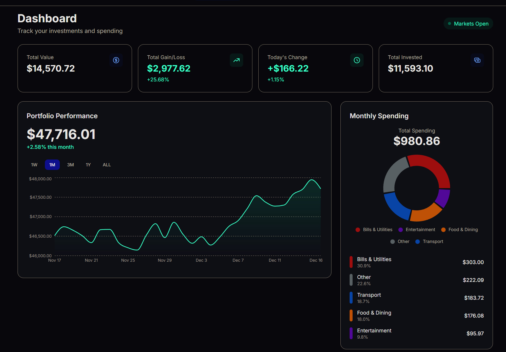
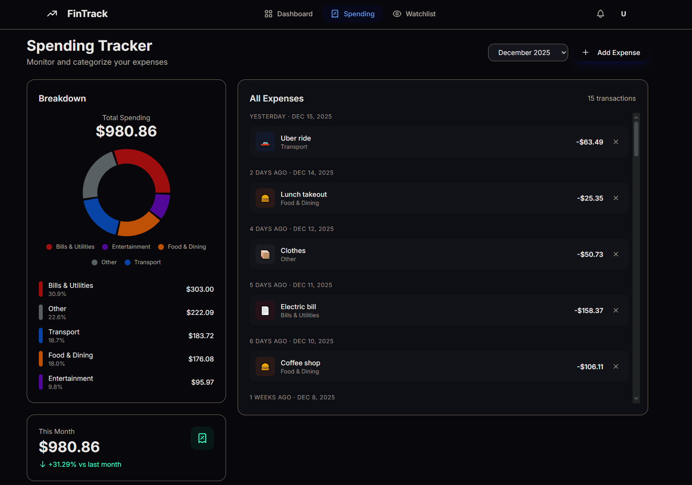
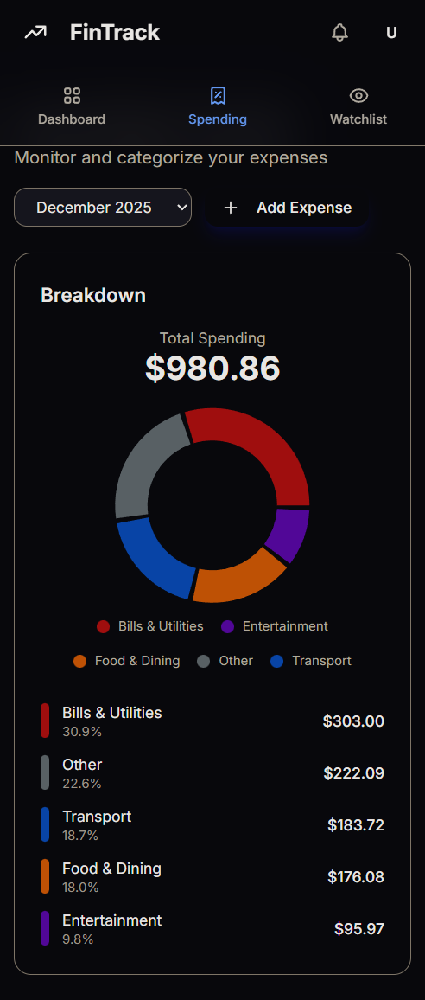

# FinTrack - Personal Finance Dashboard

A modern, responsive personal finance dashboard built with React that helps you track investments and manage spending in one interface. Built after manually tracking my investments in spreadsheets got tedious!

## Screenshots

### Dashboard

*Portfolio overview with interactive performance chart and holdings list*

### Spending Tracker

*Expense tracking with category breakdown pie chart*

### Mobile View

*Fully responsive design for mobile devices*

## Features

### Portfolio Dashboard
- **Real-time portfolio tracking** with total value and daily change
- **Interactive line charts** showing portfolio performance (1W, 1M, 3M, 1Y views)
- **Holdings management** with current price, daily change, and total value
- **Visual indicators** - green for gains, red for losses

### Spending Tracker
- **Expense entry** with amount, category, date, and description
- **Pie chart breakdown** by category (Food, Transport, Entertainment, Bills, Other)
- **Monthly comparison** showing spending trends
- **Category insights** with percentage breakdown

### Watchlist
- **Track stocks** without owning them
- **Quick view** of price and daily change
- **Easy add to portfolio** from watchlist
- **Top movers** highlighting best/worst performers

### Design
- **Dark mode by default** - easy on the eyes
- **Clean, minimal UI** inspired by modern finance apps
- **Smooth animations** on data updates and page transitions
- **Fully responsive** - works on mobile

## Tech Stack

| Technology | Purpose |
|-|-|
| **React 18** | UI library with hooks |
| **TypeScript** | Type safety and better DX |
| **Redux Toolkit** | Global state management |
| **React Router** | Client-side routing |
| **Tailwind CSS** | Utility-first styling |
| **Recharts** | Data visualization |
| **Vite** | Fast build tool |

## Architecture Decisions

- **Django over FastAPI** — Django's built-in admin interface provides immediate data management UI without building custom CRUD views. The ORM with migrations handles schema evolution as the portfolio model grew. DRF (Django REST Framework) provides serializers, viewsets, and browsable API for faster API development.

- **pandas for portfolio analytics** — Single-user scale data (hundreds of holdings, not millions) makes pandas the right tool. Rich financial functions (rolling windows, percentage changes, resampling) integrate naturally with yfinance data. NumPy operations handle returns calculations efficiently.

- **yfinance for market data** — Free, no API key required, covers all major exchanges. Good enough for a personal portfolio tracker where real-time data isn't critical. The `download()` API handles batch requests for multiple tickers efficiently.

- **Redux Toolkit for frontend state** — Centralized portfolio state prevents prop-drilling across dashboard components. RTK Query handles API caching and invalidation automatically. Redux DevTools simplify debugging state changes during development.

- **PostgreSQL over SQLite** — Needed concurrent read/write access for background data refresh jobs. JSON column support stores flexible metadata per holding. Better date/time functions for financial time series queries.

## Getting Started

### Prerequisites

- Node.js 18+ and npm

### Installation

1. **Clone the repository**
   ```bash
   git clone https://github.com/PohTeyToe/fintrack.git
   cd fintrack
   ```

2. **Install dependencies**
   ```bash
   npm install
   ```

3. **Start the development server**
   ```bash
   npm run dev
   ```

4. **Open your browser**
   Navigate to `http://localhost:3000`

### Environment Variables (Optional)

To use real stock data from Alpha Vantage API, create a `.env` file:

```bash
VITE_ALPHA_VANTAGE_KEY=your_api_key_here
```

Get a free API key at [Alpha Vantage](https://www.alphavantage.co/support/#api-key)

> Note: The app works perfectly with mock data if no API key is provided.

## Project Structure

```
src/
├── components/
│   ├── charts/           # Chart components (Portfolio, Spending, Mini)
│   ├── common/           # Reusable UI components
│   ├── portfolio/        # Portfolio-specific components
│   ├── spending/         # Spending tracker components
│   └── watchlist/        # Watchlist components
├── hooks/                # Custom React hooks
├── pages/                # Page components
├── store/                # Redux slices and store
├── types/                # TypeScript interfaces
├── utils/                # Utility functions
├── App.tsx               # Root component
└── main.tsx              # Entry point
```

## Key Features Explained

### State Management
- **Redux Toolkit** for predictable state updates
- **localStorage persistence** - your data survives refresh
- **Optimistic updates** for snappy UX

### Custom Hooks
- `usePortfolioSummary` - Calculates portfolio statistics
- `usePortfolioHistory` - Filters chart data by time range
- `useStockData` - Fetches and caches stock quotes
- `useLocalStorage` - Syncs state with localStorage

### Data Visualization
- **Area charts** for portfolio performance
- **Pie charts** for spending breakdown
- **Mini sparklines** for quick stock trends

## Responsive Design

The app is fully responsive with:
- Mobile-first approach
- Collapsible navigation on small screens
- Touch-friendly interactions
- Optimized chart sizes for different viewports

## Backend Setup

The Django backend requires a few environment variables. Copy `.env.example` and customise:

```bash
cp .env.example .env
```

| Variable | Default | Description |
|-|-|-|
| `DJANGO_SECRET_KEY` | `dev-secret-key-change-me` | Django secret key (change in prod) |
| `DJANGO_DEBUG` | `True` | Debug mode toggle |
| `DB_HOST` | `localhost` | PostgreSQL host |
| `DB_NAME` | `fintrack` | Database name |
| `DB_USER` | `fintrack` | Database user |
| `DB_PASSWORD` | `fintrack` | Database password |
| `ALPHA_VANTAGE_KEY` | *(empty)* | Optional real-time market data |

Start everything with Docker:

```bash
docker-compose up -d
```

Or run the backend manually (requires a local PostgreSQL instance):

```bash
cd backend
pip install -r requirements.txt
python manage.py migrate
python manage.py runserver
```

## API Usage Examples

All endpoints live under `/api/`. Authentication is session-based for now.

**List portfolios**
```bash
curl http://localhost:8000/api/portfolios/
```

**Get portfolio returns (1-month window)**
```bash
curl http://localhost:8000/api/portfolios/1/returns/?period=1M
```

**Create a holding**
```bash
curl -X POST http://localhost:8000/api/holdings/ \
  -H "Content-Type: application/json" \
  -d '{"portfolio": 1, "symbol": "AAPL", "shares": "10", "avg_cost": "150.00", "sector": "technology"}'
```

**Spending analytics (3-month pattern analysis)**
```bash
curl http://localhost:8000/api/spending/patterns/?period=3M
```

**Generate spending report for a date range**
```bash
curl "http://localhost:8000/api/spending/report/?start=2025-10-01&end=2025-12-31"
```

**Watchlist**
```bash
# List watched stocks
curl http://localhost:8000/api/watchlist/

# Add a stock to watchlist
curl -X POST http://localhost:8000/api/watchlist/ \
  -H "Content-Type: application/json" \
  -d '{"symbol": "NVDA"}'
```

## Known Issues

- Market data refresh is synchronous — large portfolios (50+ tickers) can timeout on the API call
- Returns calculation assumes all transactions are in USD; no multi-currency support
- yfinance occasionally returns stale data for less-traded securities
- Portfolio allocation chart doesn't account for pending sell orders
- CSV import doesn't validate ticker symbols against any exchange

## Roadmap

- [ ] Background task queue (Celery) for async market data refresh
- [ ] Multi-currency portfolio support with exchange rate conversion
- [ ] Tax-loss harvesting analysis and suggestions
- [ ] Portfolio rebalancing recommendations based on target allocation
- [ ] Email alerts for significant portfolio value changes (>5% daily)

## What I Learned

Building FinTrack taught me:
- **Redux Toolkit** patterns for scalable state management
- **TypeScript** best practices for React applications
- **Recharts** customization for data visualization
- **Tailwind CSS** for rapid, consistent styling
- **Component composition** for reusable UI

## License

MIT License - feel free to use this project for learning or as a starting point for your own finance app!
